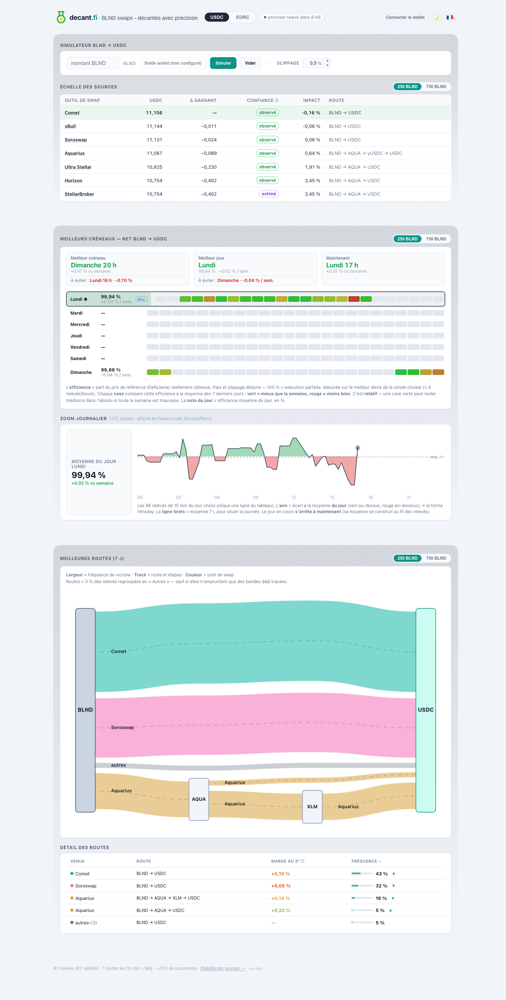

[English](README.md) · **Français**

<div align="center">

# DecantFi

### BLND swaps — accurately decanted · décantés avec précision

Un outil auto-hébergé qui trouve la **meilleure route nette** pour swapper **BLND → USDC ou EURC** sur Stellar, en recoupant plusieurs sources de cotation indépendantes et en les classant sur ce que vous **recevriez réellement**.

Conçu pour les personnes qui sortent de positions [Blend](https://www.blend.capital/) et veulent le vrai chiffre, pas un chiffre optimiste.



</div>

## Pourquoi ça existe

Différentes sources cotent le même swap différemment, et le chiffre affiché en vitrine n'est souvent **pas** ce qui arrive dans votre wallet — les frais, l'impact de prix et le routage le rognent. DecantFi interroge plusieurs sources, **re-simule** les routes qui importent et les classe sur le **montant net reçu**, de sorte que la recommandation reflète le vrai fill plutôt qu'un chiffre de brochure.

Il est délibérément étroit : BLND → USDC/EURC, le swap dont la plupart des utilisateurs de Blend ont réellement besoin. Il fait ça avec soin.

## Ce qu'il fait

- **Méta-agrège** plusieurs sources Stellar vérifiées (voir [Sources](#sources)) en parallèle, et est **tolérant aux pannes** — une source hors ligne ne bloque jamais le classement.
- **Classe sur le net reçu** — les frais d'agrégateur, les frais de pool et l'impact de prix sont tous pris en compte. Le gas est payé séparément en XLM (variable par transaction, affiché à part — jamais caché dans le net).
- **Re-cote en live** dans le simulateur web, et re-simule les sources dont la cote affichée et le fill réel peuvent diverger, de sorte que le chiffre affiché est celui que vous obtenez.
- **Gère EURC de deux façons** — BLND→EURC direct versus composite via-USDC — et garde celui qui rapporte le plus, en exposant honnêtement le cas quand les deux se valent.
- **Enregistre l'historique** — un collecteur en arrière-plan journalise les cotes dans le temps pour que le tableau de bord puisse mettre en avant les routes gagnantes et les fenêtres plus calmes pour trader.

## Honnête par conception

Le graphe de routes montre où la valeur circule sur les 7 derniers jours — **la largeur des bandes = fréquence de victoire d'une route**, **couleur = l'outil de swap**, les routes peu fréquentes étant regroupées dans « Autres ». Aucun chiffre inventé, aucun flux fusionné-mais-incompatible.


Deux principes sur lesquels le projet ne transige pas :

1. **Classer sur le fill réel, pas sur la cote.** Lorsque la sortie annoncée par une source diffère de ce que sa transaction retourne effectivement, DecantFi classe et affiche le **fill simulé réel**.
2. **Le net, c'est ce que vous recevez.** Les frais de swap et l'impact de prix sont dans le net ; **le gas (XLM) est affiché séparément**, exactement comme votre wallet et un explorateur de blocs le rapportent.

## Sécurité & sûreté

Gérer les swaps de tierces personnes est une position de confiance, et le projet la traite comme telle.

**Non-custodial par construction.** DecantFi **ne demande jamais, ne stocke jamais et ne manipule jamais votre clé privée.** Le CLI est strictement en lecture seule — il recommande et ne signe rien. Dans l'application web, les transactions sont **signées dans votre propre wallet** (Freighter, xBull, Lobstr, Albedo, Rabet, Hana) ; le serveur se contente de relayer une transaction **que vous avez déjà signée**, et valide qu'il s'agit d'un swap ou d'une opération trustline avant de la relayer — il ne peut jamais être détourné en un autre type de transaction.

**Durcissement effectué avant l'ouverture du code source** (un audit ciblé, tout sur `main`) :

- **En-têtes web** — Content-Security-Policy, `X-Frame-Options`, `X-Content-Type-Options`, politique de référent ; échappement en sortie sur chaque sink alimenté par l'API.
- **Résistance aux abus** — rate-limiting par IP sur les endpoints quote/build/submit, cooldown de rafraîchissement, plafonds stricts sur les tailles d'entrée, assets et sources sur liste d'autorisation.
- **Hygiène des secrets** — les clés API RPC sont expurgées des logs et de la base de données ; `500` génériques aux clients, détail conservé côté serveur ; **zéro secret** dans le dépôt (scan complet de l'historique git + `gitleaks` en CI).
- **Supply chain** — image de base épinglée par digest, GitHub Actions épinglées par SHA, le seul bundle de navigateur vendoré est livré avec une somme de contrôle et un script de build reproductible, `npm audit` + `gitleaks` bloquent chaque push, et Dependabot maintient les dépendances à jour (vérifiées, jamais fusionnées à l'aveugle).
- **Conteneur** — build multi-étapes, `--omit=dev`, système de fichiers racine `read_only`, capabilities supprimées, `no-new-privileges`.

`npm audit --omit=dev` en production est **propre**. Voir la [FAQ](FAQ.fr.md) pour le modèle de menace et ce qui est explicitement hors périmètre.

Le tableau de bord est aussi honnête sur sa propre plomberie — une **page de stabilité** affiche la disponibilité par source et les pannes, ainsi que la santé du Soroban RPC dont il dépend :


## Sources

Interrogées en parallèle, tolérantes aux pannes : **xBull**, **Aquarius**, **Soroswap** (keyless, via le `soroswap-router-sdk` local), **Ultra Stellar** (StellarTerm), **Horizon** strict-send (un plancher fiable), et une sonde directe de la pool **Comet** (BLND/USDC).

> **StellarBroker** est actuellement **déconnecté** : son endpoint keyless est soumis à un rate-limiting sous interrogation automatique répétée. Il reviendra via une intégration authentifiée par clé — voir la [FAQ](FAQ.fr.md).

## Auto-hébergement

**Prérequis :** Docker (déploiement) · Node ≥ 24 pour le développement local (le collecteur utilise `node:sqlite` ; développé et testé sur Node 26).

```bash
cp .env.example .env        # ajuster si nécessaire (chemin des données, clés optionnelles)
docker compose build
docker compose up -d
# Interface web : http://localhost:8080
```

Deux services démarrent : un **collecteur** qui cote périodiquement BLND→USDC/EURC et persiste les résultats dans SQLite (rétention étagée), et un **tableau de bord web** + simulateur live sur le port 8080.

Définissez le répertoire de données hôte avec `DECANTFI_DATA` (défaut `./data` ; ex. `/docker/decantfi/backend/data` sur un serveur). Si vous forkez, définissez `IMAGE_OWNER` sur votre compte. Toutes les clés `.env` sont optionnelles et documentées dans [`.env.example`](.env.example) et la [FAQ](FAQ.fr.md).

> Exposé publiquement ? Mettez-le derrière un reverse proxy avec TLS (Caddy / nginx) — l'application parle HTTP simple et est conçue pour s'appuyer sur un proxy.

## CLI (développement / scripts)

```bash
npm install
npm run quote -- 1000 USDC              # meilleure route BLND -> USDC pour 1000 BLND
npm run quote -- 1000 EURC              # vers EURC : direct vs via-USDC, meilleur net conservé
npm run quote -- 1000 USDC --split      # analyse en split (25 / 50 / 100 %)
npm run quote -- 500 USDC --slippage 30 # tolérance 0,3 % (30 bps)
npm run quote -- 1000 USDC --json       # JSON brut (pour les scripts)
```

Options : `--from <ASSET>` (défaut BLND), `--slippage <bps>` (défaut 50), `--split`, `--json`, `--balance`, `--help`. Le CLI **ne signe et ne soumet rien** — il classe les routes ; l'exécution reste dans votre wallet.

## Limites connues (v1)

- **Slippage par jambe (EURC via-USDC)** n'est pas encore réparti entre les deux jambes — aucun effet en v1 ; arrivera avec l'exécution multi-jambe.
- **Soroswap keyless** route sur la **paire directe** uniquement ; la méta-agrégation des autres sources compense le multi-hop manquant.
- **Le prix spot** provient de DefiLlama (colonne d'impact de prix indicative) ; s'il est indisponible, cette colonne se masque — le classement net reste valide.
- **EURC direct ≈ via-USDC** quand la même source gagne les deux : les nets sont identiques car il n'existe pas de marché BLND/EURC indépendant. L'outil le dit explicitement.
- **Comet** est une sonde de prix de pool en lecture seule via un compte témoin ; elle peut se rétracter pour des montants très importants.

## Développement

```bash
npm test           # tests unitaires — adaptateurs figés sur de vraies fixtures, normalisation, classement, collecteur, BDD
npm run typecheck
```

**Structure du projet :** `core/` (moteur pur : adaptateurs, normalisation net, classement, split, logique EURC, gas, prix) · `cli/` (ligne de commande) · `collector/` + `db/` (daemon de journalisation + SQLite) · `web/` (tableau de bord auto-hébergé : simulateur live + graphe de routes).

## Documentation

- [FAQ](FAQ.fr.md) — sécurité, déploiement, choix de conception, modèle de menace
- [CONTRIBUTING](CONTRIBUTING.md) — installation, tests, conventions

---

> 🥚 Quelque part dans le tableau de bord, DecantFi raconte **un seul mensonge** — magnifiquement, à dessein. Il ne se montre qu'à un code de triche que tout gamer de plus de trente ans connaît par cœur. Bonne chasse.

## Licence

[GPL-3.0-or-later](LICENSE). DecantFi lit les données Stellar on-chain et de façon keyless partout où c'est possible — l'architecture qui convient le mieux à un outil dont tout l'objectif est de vous dire la vérité sur un swap.
