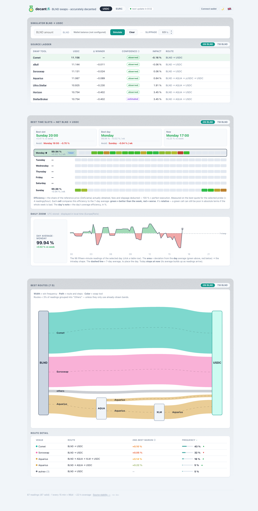

**English** · [Français](README.fr.md)

<div align="center">

# DecantFi

### BLND swaps — accurately decanted

A self-hosted tool that finds the **best net route** to swap **BLND → USDC or EURC** on Stellar, by cross-checking several independent quoting sources and ranking them on what you would **actually receive**.

Built for people exiting [Blend](https://www.blend.capital/) positions who want the real number, not an optimistic one.



</div>

## Why it exists

Different venues quote the same swap differently, and the headline number a venue advertises is often **not** what lands in your wallet — fees, price impact and routing skim it down. DecantFi queries multiple sources, **re-simulates** the routes that matter, and ranks them on the **net amount received**, so the recommendation reflects the real fill rather than a brochure figure.

It is deliberately narrow: BLND → USDC/EURC, the swap most Blend users actually need. It does that one thing carefully.

## What it does

- **Meta-aggregates** several verified Stellar sources (see [Sources](#sources)) in parallel, and is **fault-tolerant** — one source being down never blocks the ranking.
- **Ranks on net return** — aggregator fees + pool fees + price impact are all accounted for. Gas is paid separately in XLM (variable per transaction, shown on its own — never hidden inside the net).
- **Re-quotes live** in the web simulator, and re-simulates the venues whose advertised quote and real fill can diverge, so the number you see is the number you get.
- **Handles EURC two ways** — direct BLND→EURC versus composite via-USDC — and keeps whichever nets more, stating the case honestly when they tie.
- **Records history** — a background collector logs quotes over time so the dashboard can surface the routes that win and the calmer windows to trade in.

## Honest by design

The route graph shows where value flows over the last 7 days — **band width = how often a route wins**, **colour = the swap tool**, with low-frequency routes grouped into "Others". No invented numbers, no merged-but-incompatible flows.


Two principles the project does not bend on:

1. **Rank on the real fill, not the quote.** Where a venue's advertised output differs from what its transaction actually returns, DecantFi ranks and displays the **simulated real fill**.
2. **Net is what you receive.** Swap fees and price impact are inside the net; **gas (XLM) is shown separately**, exactly as your wallet and a block explorer report it.

## Security & safety

Handling other people's swaps is a position of trust, so the project treats it like one.

**Non-custodial by construction.** DecantFi **never requests, stores, or handles your private key.** The CLI is strictly read-only — it recommends and signs nothing. In the web app, transactions are **signed inside your own wallet** (Freighter, xBull, Lobstr, Albedo, Rabet, Hana); the server only relays a transaction **you already signed**, and validates that it is a swap or trustline operation before relaying it — it can never be turned into a different kind of transaction.

**Hardening done before opening the source** (a focused audit pass, all of it on `main`):

- **Web headers** — Content-Security-Policy, `X-Frame-Options`, `X-Content-Type-Options`, referrer policy; output-escaped on every API-fed sink.
- **Abuse resistance** — per-IP rate-limiting on quote/build/submit endpoints, refresh cooldown, hard caps on input sizes, allow-listed assets and venues.
- **Secret hygiene** — RPC API keys are redacted from logs and the database; generic `500`s to clients with detail kept server-side; **zero secrets** in the repo (full git-history scan + `gitleaks` in CI).
- **Supply chain** — base image pinned by digest, GitHub Actions pinned by SHA, the one vendored browser bundle ships with a checksum and a reproducible build script, `npm audit` + `gitleaks` gate every push, and Dependabot keeps dependencies current (verified, never blind-merged).
- **Container** — multi-stage build, `--omit=dev`, `read_only` root filesystem, dropped capabilities, `no-new-privileges`.

Production `npm audit --omit=dev` is **clean**. See the [FAQ](FAQ.md) for the threat model and what is explicitly out of scope.

The dashboard is also honest about its own plumbing — a **stability page** shows per-source uptime and failures, and the health of the Soroban RPC it depends on:


## Sources

Queried in parallel, fault-tolerant: **xBull**, **Aquarius**, **Soroswap** (keyless, via the local `soroswap-router-sdk`), **Ultra Stellar** (StellarTerm), **Horizon** strict-send (a reliable floor), and a direct **Comet** pool probe (BLND/USDC).

> **StellarBroker** is currently **disconnected**: its keyless endpoint is rate-limited under automated polling. It will return through an authenticated, key-based integration — see the [FAQ](FAQ.md).

## Self-hosting

**Prerequisites:** Docker (deployment) · Node ≥ 24 for local development (the collector uses `node:sqlite`; developed and tested on Node 26).

```bash
cp .env.example .env        # adjust if needed (data path, optional keys)
docker compose build
docker compose up -d
# Web UI: http://localhost:8080
```

Two services start: a **collector** that periodically quotes BLND→USDC/EURC and persists results to SQLite (tiered retention), and a **web** dashboard + live simulator on port 8080.

Set the host data directory with `DECANTFI_DATA` (default `./data`; e.g. `/docker/decantfi/backend/data` on a server). If you fork, set `IMAGE_OWNER` to your account. All `.env` keys are optional and documented in [`.env.example`](.env.example) and the [FAQ](FAQ.md).

> Publicly exposed? Put it behind a reverse proxy with TLS (Caddy / nginx) — the app speaks plain HTTP and is designed to sit behind one.

## CLI (development / scripting)

```bash
npm install
npm run quote -- 1000 USDC              # best route BLND -> USDC for 1000 BLND
npm run quote -- 1000 EURC              # to EURC: direct vs via-USDC, best net kept
npm run quote -- 1000 USDC --split      # split analysis (25 / 50 / 100 %)
npm run quote -- 500 USDC --slippage 30 # 0.3 % tolerance (30 bps)
npm run quote -- 1000 USDC --json       # raw JSON (for scripts)
```

Options: `--from <ASSET>` (default BLND), `--slippage <bps>` (default 50), `--split`, `--json`, `--balance`, `--help`. The CLI **signs and submits nothing** — it ranks routes; execution stays in your wallet.

## Known limits (v1)

- **Per-leg slippage (EURC via-USDC)** is not split across the two legs yet — no effect in v1; lands with multi-leg execution.
- **Soroswap keyless** routes on the **direct pair** only; meta-aggregation from other sources compensates for the missing multi-hop.
- **Spot price** comes from DefiLlama (indicative price-impact column); if unavailable, that column hides — the net ranking stays valid.
- **EURC direct ≈ via-USDC** when the same source wins both: nets are identical because there is no independent BLND/EURC market. The tool says so explicitly.
- **Comet** is a read-only pool-price probe via a witness account; it may retract for very large amounts.

## Development

```bash
npm test           # unit tests — adapters frozen on real fixtures, normalisation, ranking, collector, DB
npm run typecheck
```

**Project structure:** `core/` (pure engine: adapters, net normalisation, ranking, split, EURC logic, gas, prices) · `cli/` (command line) · `collector/` + `db/` (logging daemon + SQLite) · `web/` (self-hosted dashboard: live simulator + route graph).

## Documentation

- [FAQ](FAQ.md) — safety, deployment, design choices, threat model
- [CONTRIBUTING](CONTRIBUTING.md) — install, tests, conventions

## License

[GPL-3.0-or-later](LICENSE). DecantFi keeps Stellar's data on-chain and keyless wherever it can — the architecture that best fits a tool whose whole point is to tell you the truth about a swap.
