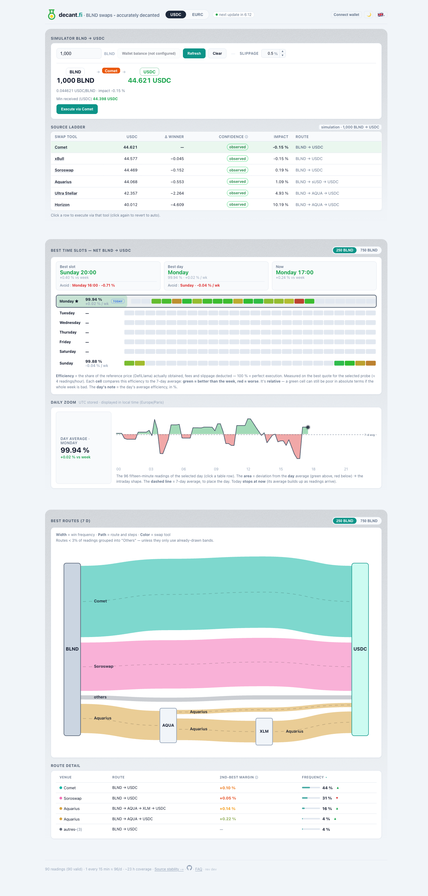
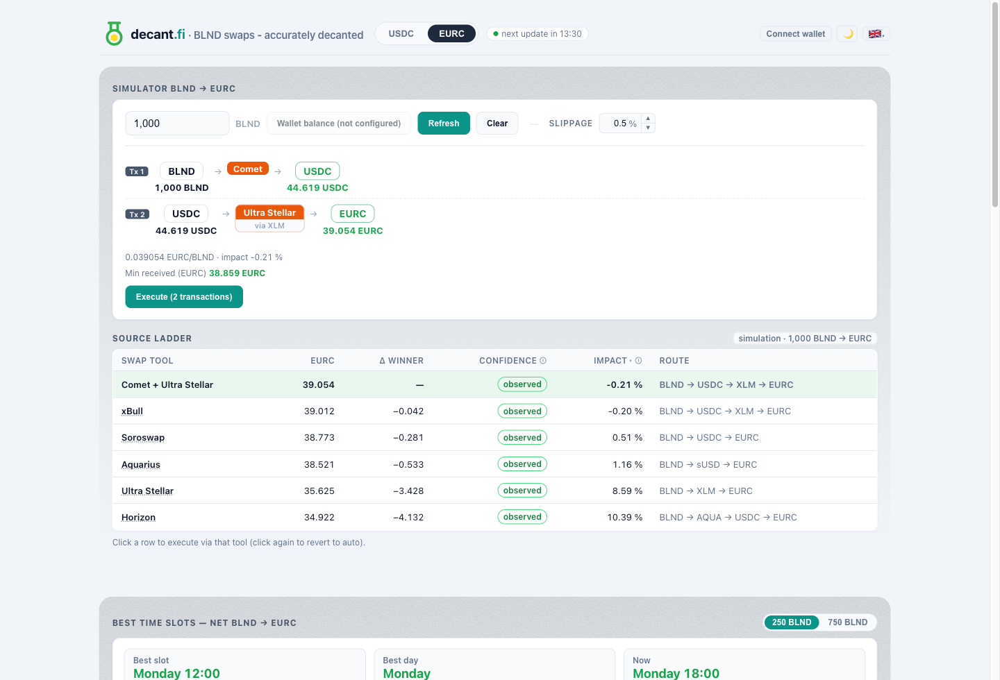
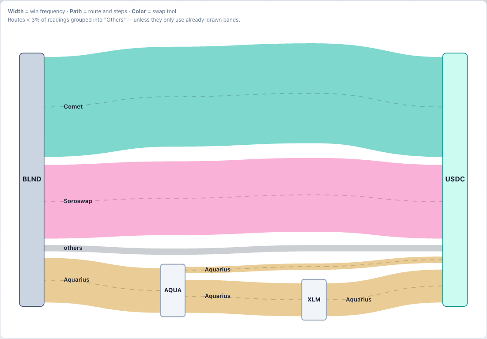
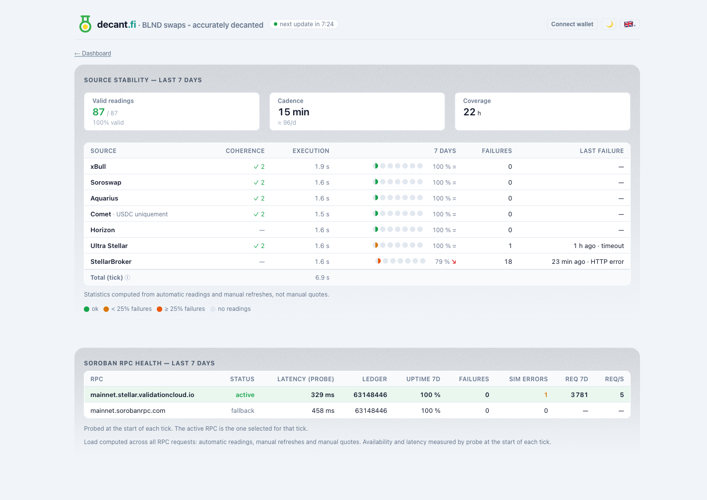
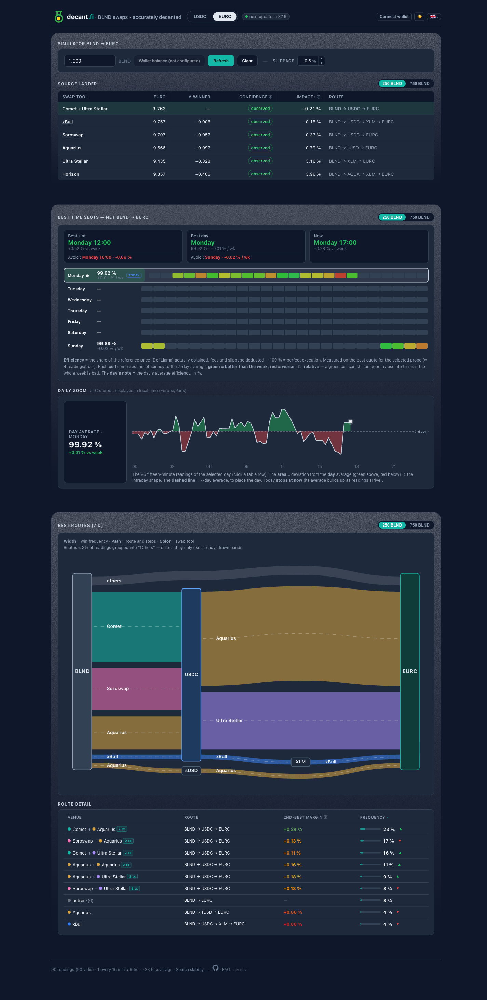
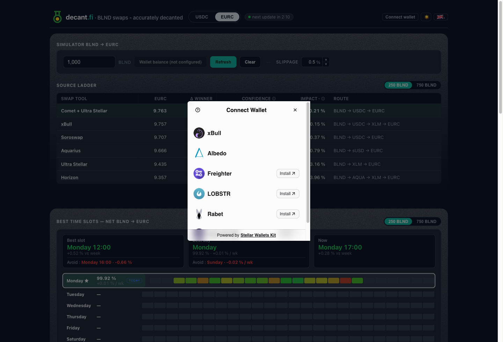

**English** · [Français](README.fr.md)

<div align="center">

# DecantFi

### BLND swaps — accurately decanted

A self-hosted tool that finds the **best net route** to swap **BLND → USDC or EURC** on Stellar, by cross-checking several independent quoting sources and ranking them on what you would **actually receive**.

Built for people exiting [Blend](https://www.blend.capital/) positions who want the real number, not an optimistic one.



</div>

## Why it exists

Different venues quote the same swap differently, and the headline number a venue advertises is often **not** what lands in your wallet — fees, price impact and routing skim it down. DecantFi queries multiple sources, **re-simulates** the routes that matter, and ranks them on the **net amount received**, so the recommendation reflects the real fill rather than a brochure figure.

It is deliberately narrow: BLND → USDC/EURC, the swap most Blend users actually need. It does that one thing carefully.

## The app

### Live simulator

Type a BLND amount, hit **Simulate**, and DecantFi quotes every source live and ranks them by net output — the screenshot above is a real `1,000 BLND → USDC` run. Sources are queried **in parallel** and the simulator is **fault-tolerant**: a source being down never blocks the ranking.

### Confidence, shown honestly

Every quote carries a confidence flag, because not all numbers are equally trustworthy:

- **Observed** — a real fill seen in live simulation (an executable route).
- **Estimated** — a floor/ceiling, or a route that couldn't be simulated.
- **Unavailable** — source unreachable.

The ranking trusts **Observed** over **Estimated**, so an optimistic headline never outranks a verified fill. This is the core of the project: rank on the real fill, not the quote.

### Two probe sizes (250 / 750 BLND)

The winning route *and* the price impact both depend on trade size — a venue that's best for a small exit can lose for a larger one. DecantFi probes at **250 and 750 BLND** so the dashboard can show how the answer changes with size; flip between them with the size toggle. (The live simulator quotes any amount you type.)

### EURC: direct vs composite via-USDC

There is no deep direct BLND/EURC market, so the best exit to EURC is often **BLND → USDC → EURC** — a composite of two swaps — rather than direct. DecantFi quotes both and keeps whichever nets more. Here the winner is a `Comet + Ultra Stellar` composite routed through USDC:



### Dual price impact (Local vs EVM)

For EURC, price impact is shown two ways — toggle it from the column header:

- **Local** — gap vs the EURC price **on Stellar** (the SDEX order book). What matters if you plan to **stay on Stellar**.
- **EVM** — gap vs the **global** EURC price (Base / Ethereum). What matters if you plan to **bridge out**, where Stellar's premium or discount becomes a real gain or loss.

(USDC is identical in both modes.) Positive = you receive less, negative = you receive more.

### Route graph

The dashboard graphs where value flows over the last 7 days — **band width = how often a route wins**, **colour = the swap tool**, low-frequency routes grouped into "Others". No invented numbers, no merged-but-incompatible flows.



### Source stability

DecantFi is honest about its own plumbing too: a stability page shows per-source uptime and failures, plus the health of the Soroban RPC it depends on.



### Light / dark theme · four languages

A light and a dark theme, and a UI available in **English, French, Spanish and Portuguese** (auto-detected, switchable).



## Security & safety

Handling other people's swaps is a position of trust, so the project treats it like one.

**Non-custodial by construction.** DecantFi **never requests, stores, or handles your private key.** The CLI is strictly read-only. In the web app, transactions are **signed inside your own wallet** (Freighter, xBull, Lobstr, Albedo, Rabet, Hana); the server only relays a transaction **you already signed**, and validates that it is a swap or trustline operation before relaying it — it can never be turned into a different kind of transaction.



**Hardening done before opening the source** (a focused audit pass, all on `main`):

- **Web headers** — Content-Security-Policy, `X-Frame-Options`, `X-Content-Type-Options`, referrer policy; output-escaped on every API-fed sink.
- **Abuse resistance** — per-IP rate-limiting on quote/build/submit endpoints, refresh cooldown, hard caps on input sizes, allow-listed assets and venues.
- **Secret hygiene** — RPC API keys redacted from logs and the database; generic `500`s to clients with detail kept server-side; **zero secrets** in the repo (full git-history scan + `gitleaks` in CI).
- **Supply chain** — base image pinned by digest, GitHub Actions pinned by SHA, the one vendored browser bundle ships with a checksum and a reproducible build script, `npm audit` + `gitleaks` gate every push, Dependabot keeps dependencies current (verified, never blind-merged).
- **Container** — multi-stage build, `--omit=dev`, `read_only` root filesystem, dropped capabilities, `no-new-privileges`.

Production `npm audit --omit=dev` is **clean**. See the [FAQ](FAQ.md) for the threat model and what is explicitly out of scope.

## Sources

Queried in parallel, fault-tolerant: **xBull**, **Aquarius**, **Soroswap** (keyless, via the local `soroswap-router-sdk`), **Ultra Stellar** (StellarTerm), **Horizon** strict-send (a reliable floor), and a direct **Comet** pool probe (BLND/USDC).

> **StellarBroker** is now integrated via its **authenticated key-based WebSocket**. Quotes are classed on the estimate, with the realizable SDEX floor shown in the detail — StellarBroker's best price is only achievable through its own execution layer. See the [FAQ](FAQ.md).

## Install — self-host with Docker

**Prerequisites:** Docker + Docker Compose. (Node ≥ 24 is only needed for local development / the CLI; the collector uses `node:sqlite`, developed and tested on Node 26.)

```bash
git clone https://github.com/actarus314/DecantFi.git
cd DecantFi
cp .env.example .env          # all keys optional — see the table below
docker compose build
docker compose up -d
```

Then open **http://localhost:8080**.

**What runs** — two services:
- **collector** — periodically quotes BLND→USDC/EURC (250/750 BLND probes) and persists each measurement to SQLite, with tiered retention (raw → structured → hourly rollup).
- **web** — the dashboard + live simulator, on port 8080.

**Configuration** (`.env`, every key optional):

| Key | Purpose |
|-----|---------|
| `DECANTFI_DATA` | Host directory for the SQLite database (default `./data`; e.g. `/docker/decantfi/backend/data` on a server). |
| `SOROSWAP_API_KEY` | Optional; only used by the **execution** path to build Soroswap transactions. Quoting is keyless. |
| `STELLAR_RPC_URL` / `STELLAR_HORIZON_URL` | Override the default public endpoints (a dedicated RPC is recommended under load). |
| `COLLECTOR_CADENCE_SEC` · `COLLECTOR_SIZES_BLND` · `COLLECTOR_PAIRS` | Collector cadence (default 900 s), probe sizes (`250,750`), pairs (`USDC,EURC`). |
| `IMAGE_TAG` | Image version to deploy; pin to a specific release in production, never use `latest`. |
| `STELLAR_RPC_URL_FALLBACK` | Fallback RPC endpoint for failover (switched in on the next tick if the primary fails). |
| `WEB_HOST_PORT` | Host port to publish the web UI on (the container always listens on 8080). |

**Common operations:**

```bash
docker compose logs -f web          # follow web logs
docker compose ps                   # service status
docker compose pull && docker compose up -d   # update (if using a published image)
# or, building locally after a git pull:
git pull && docker compose build && docker compose up -d --force-recreate
```

> **Exposing it publicly?** Put it behind a reverse proxy with TLS (Caddy / nginx) — the app speaks plain HTTP by design and ships per-IP rate-limiting; the proxy adds TLS and is the right place for any access control.

## CLI (development / scripting)

```bash
npm install
npm run quote -- 1000 USDC              # best route BLND -> USDC for 1000 BLND
npm run quote -- 1000 EURC              # to EURC: direct vs via-USDC, best net kept
npm run quote -- 1000 USDC --split      # split analysis (25 / 50 / 100 %)
npm run quote -- 500 USDC --slippage 30 # 0.3 % tolerance (30 bps)
npm run quote -- 1000 USDC --json       # raw JSON (for scripts)
```

Options: `--from <ASSET>` (default BLND), `--slippage <bps>` (default 50), `--split`, `--json`, `--balance`, `--help`. The CLI **signs and submits nothing** — it ranks routes; execution stays in your wallet.

## Known limits (v1)

- **Per-leg slippage (EURC via-USDC)** is not split across the two legs yet — no effect in v1; lands with multi-leg execution.
- **Soroswap keyless** routes on the **direct pair** only; meta-aggregation from other sources compensates for the missing multi-hop.
- **Spot price** comes from DefiLlama (indicative price-impact column); if unavailable, that column hides — the net ranking stays valid.
- **EURC direct ≈ via-USDC** when the same source wins both: nets are identical because there is no independent BLND/EURC market. The tool says so explicitly.
- **Comet** is a read-only pool-price probe via a witness account; it may retract for very large amounts.

## Development

```bash
npm test           # unit tests — adapters frozen on real fixtures, normalisation, ranking, collector, DB
npm run typecheck
```

**Project structure:** `core/` (pure engine: adapters, net normalisation, ranking, split, EURC logic, gas, prices) · `cli/` (command line) · `collector/` + `db/` (logging daemon + SQLite) · `web/` (self-hosted dashboard: live simulator + route graph).

## Documentation

- [FAQ](FAQ.md) — safety, deployment, design choices, threat model
- [CONTRIBUTING](CONTRIBUTING.md) — install, tests, conventions

---

> 🥚 Somewhere in the dashboard, DecantFi tells **exactly one lie** — gloriously, on purpose. It only shows itself to a cheat code that any gamer over thirty knows by heart. Happy hunting.

## License

[GPL-3.0-or-later](LICENSE). DecantFi keeps Stellar's data on-chain and keyless wherever it can — the architecture that best fits a tool whose whole point is to tell you the truth about a swap.
